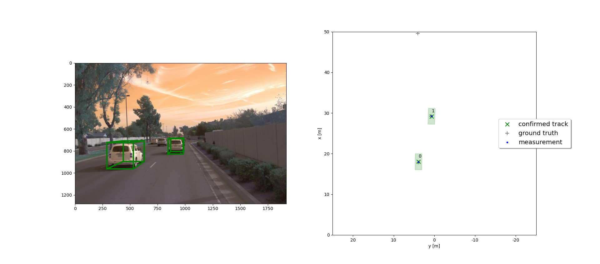

# Track 3D-Objects Over Time
This project serves as an extension to the previous project where we set up information extraction from LiDAR. Here, we perform tracking of object over time using both LiDAR and camera sensors. The four steps involved include -
- Setting up the Extended 3D Kalman Filter
- Setting up Track management using a track score and a track automaton
- Setting up data association using association matrix to pair a measurement to a track
- Setting up the camera sensor and tracking objects via both the LiDAR and camera sensors to achieve a lower RMSE.

## Step 1: Implementing the Filter

Kalman Filter

## Step 2: Setting up Tracking Score and Tracking State

## Step 3: Measurement Track Association

## Step 4: Incorporating Camera measurements to Sensor Fusion

### 1. Which results did you achieve? Which part of the project was most difficult for you to complete, and why?

At the end, we achieved a mean RMSE lower than 0.25 and achieved tracking without losing the track at any point. The hardest part was setting up the data association since in real world scenarios the data from sensors is very noisy and leads to many ghost tracks.

### 2. Do you see any benefits in camera-lidar fusion compared to lidar-only tracking (in theory and in your concrete results)?

There are huge benefits to using camera-lidar fusion since each of them compensate for the errors in the other sensor and provide a more robust model for tracking. This is evidenced by a low mean RMSE

### 3. Which challenges will a sensor fusion system face in real-life scenarios? Did you see any of these challenges in the project?

Sensor fusion would face challenges when partial data is provided. There can be cases where the field of view of one sensor is less than the field of view of the other sensor. In these cases, sensor fusion doesn't work or if it does it reduced the field of view.

### 4. Can you think of ways to improve your tracking results in the future?

The system can probably be improved through more computation power. The more computation power on a YOLO system, the more robust their output is. This might reduce false positives.

## Summary
We have successfully implemented a tracking framework which fuses measurement from two sensors track targets persistently using a robust kalman filter.
